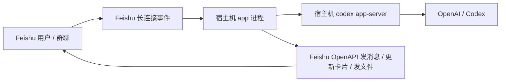

# Codex Feishu Bot

把 `codex app-server` 接到飞书群聊，并把“创建飞书应用、开事件订阅、补权限、发布版本、宿主机启动”这整套流程尽量交给用户自己的 Codex 自动完成。

这个仓库的主路径不是“用户自己看文档手点控制台”，而是：

1. 用户打开 Codex，模型切到 `GPT-5.4`，推理强度设成 `xhigh`
2. 用户把仓库地址贴给 Codex
3. Codex 按本仓库的 `README.md`、`AGENTS.md` 和 `docs/` 自己完成环境准备、浏览器自动化和部署
4. 用户只在必须的时候介入：登录 Feishu / OpenAI，或处理租户管理员审批

## 这套仓库能自动做什么

- 用 Chrome DevTools Protocol 启动一个专用浏览器实例
- 让 Codex 通过浏览器自动化操作飞书开放平台
- 创建或复用一个企业自建应用
- 打开机器人能力
- 切到飞书长连接模式
- 订阅 `im.message.receive_v1`
- 补齐 IM 相关权限
- 发布版本
- 把 `FEISHU_APP_ID` / `FEISHU_APP_SECRET` 写回 `.env.real`
- 在宿主机启动 `codex app-server` 和 `app` 服务
- 跑健康检查和 smoke check

默认情况下，运行时 `Codex` 看到的工作目录是 `DEFAULT_WORKSPACE`（默认 `/home/overlogged`），不是这个仓库本身。给用户的导出文件会写到这个工作目录下的 `.codex-feishu-bot/artifacts/`。
聊天运行态快照也会写到工作目录下的 `.codex-feishu-bot/runtime-state.json`，因此服务重启后仍能保留 `chat -> thread` 映射和最近消息投影；但重启前未完成的 run 会被标记为已中断，不会继续占着 active turn。服务重启完成后，机器人会自动在受影响的群里发一条提示，告诉用户可以直接回复“继续”。

## 用户还需要做什么

只有这几类动作仍然属于用户：

- 登录飞书开放平台
- 登录 OpenAI / Codex
- 处理 SSO、2FA 或租户管理员审批

不要把普通的开发者平台配置步骤推回给用户。

## 最短上手路径

### 1. 准备机器

建议环境：

- macOS 或 Linux
- Node.js 22+
- `pnpm`
- Google Chrome
- Codex Desktop 或可用的 Codex 会话

### 2. 让 Codex 接管

把这段 prompt 直接贴给 Codex：

```text
打开这个仓库后，严格按照 README.md、AGENTS.md、docs/codex-bootstrap-playbook.md、docs/feishu-console-automation.md 执行，不要把普通的控制台配置步骤推回给我。先运行 pnpm install、pnpm bootstrap:env、pnpm chrome:debug。然后先明确问我一个问题：是否要创建新的机器人。如果我回答“要”，就异步执行 `npx -y lark-op-cli@latest create-bot --name "Codex 机器人"` 并持续读取输出；如果过程中出现扫码登录，请把 ASCII 二维码原样转发给我。如果我回答“不要”，再确认我是否已经登录飞书开放平台或 OpenAI/Codex；如果我没登录，再停下来让我登录。登录完成后，就继续走原来的浏览器和 agent-browser / Chrome CDP 方案，只选择已有机器人并完成后续配置，不要再创建新的机器人。拿到 FEISHU_APP_ID 和 FEISHU_APP_SECRET 后写回 .env.real，然后在宿主机运行 `pnpm codex:host`、`pnpm build:host`、`pnpm start`，再用 `pnpm host:smoke` 验证服务，最后告诉我怎么在飞书里测试。群聊工作区绑定必须通过私聊机器人发送“工作区”获取编号，再回群里 `@机器人 编号`，或用自然语言完成绑定。
```

同样的 prompt 也单独放在 [docs/codex-bootstrap-prompt.md](docs/codex-bootstrap-prompt.md)。

### 3. Codex 会执行的本地命令

```bash
pnpm install
pnpm bootstrap:env
pnpm chrome:debug
pnpm codex:host
pnpm build
pnpm start
pnpm host:smoke
```

## 关键文档

- [AGENTS.md](AGENTS.md)：给 Codex 的仓库级操作约束
- [docs/codex-bootstrap-playbook.md](docs/codex-bootstrap-playbook.md)：Codex 的执行剧本
- [docs/feishu-console-automation.md](docs/feishu-console-automation.md)：飞书开放平台需要达到的目标状态
- [docs/open-source-scope.md](docs/open-source-scope.md)：v1 自动化边界

## 浏览器自动化路径

这个仓库默认把“飞书开发者平台配置”视为浏览器自动化任务，而不是应用运行时的一部分。

推荐做法：

```bash
pnpm chrome:debug
```

这会启动一个专用的 Chrome 调试实例，并暴露本地 CDP 端口。之后 Codex 可以通过任意可用的浏览器自动化能力接管这个浏览器；如果机器上装了 `agent-browser`，典型命令是：

```bash
agent-browser --cdp 9222 open https://open.feishu.cn/app
```

如果 `agent-browser` 不在机器上，Codex 也可以用任何可用的 CDP/DevTools 能力，只要它真的去操作浏览器，而不是让用户手动点一遍。

## Host 运行架构



默认运行路径是宿主机双进程：

- `codex app-server`：先在宿主机独立启动
- `app`：Node 服务，连接外部 `codex app-server`

对应命令：

```bash
pnpm codex:host
pnpm build:host
pnpm start
pnpm host:smoke
```

各 CLI 都按常驻 server/会话协议接入，不再每条消息重开进程：

- `codex`：连接宿主机 `codex app-server`（WebSocket JSON-RPC）
- `kimi`：启动 `kimi acp`（Agent Client Protocol，stdio JSON-RPC），按群复用长驻会话
- `pi`：启动 `pi --mode rpc`（stdio JSON-RPC server），按群复用长驻进程；活跃 turn 内收到新消息会用 `abort` 打断当前 turn，再用最新消息立即重跑
- `claude`：仍为一次性 CLI 调用

默认工作目录是 `/home/overlogged`。群聊只能绑定这个根目录下的一级子目录，不能直接把仓库根目录当运行工作区。

## 按群绑定

每个群的绑定会决定：

- 目录编号
- CLI 类型
- Codex 模型与思考深度（使用 Codex 时）

所有会话都在宿主机裸机直接运行。
Codex 默认使用 `gpt-6-astra` 和 `high`；也可以绑定 `gpt-5.6-sol`，并显式指定 `low`、`medium`、`high`、`xhigh`、`max` 或 `ultra`。

常见绑定方式：

- 私聊机器人发 `工作区`
- 回到群里发 `@机器人 12`
- 或 `@机器人 claude 12`
- 或 `@机器人 codex GPT6 high 12`
- 或 `@机器人 codex 5.6 Sol xhigh 12`
- 或 `@机器人 kimi 12`
- 或 `@机器人 pi 12`
- 或 `@机器人 pi ds4 flash 12`
- 或自然语言，例如 `@机器人 把这个群切到 12 号目录`

## 额度与用量统计

- 私聊机器人发 `额度` / `余量` / `用量` / `token` / `usage` / `quota` / `stats`，或在群里 `@机器人 额度`，即可同步查看额度与用量统计，不会启动任务
- 群里也可以用自然语言问额度，例如 `@机器人 还剩多少额度`，由群控制 agent 的 `show_quota` 意图返回同一份报告
- 报告包含 Codex 账号实时额度窗口、Kimi 账号实时额度（读取本机 kimi CLI 登录态，含 k3 等全部模型）、Codex 累计用量，以及各 CLI 本月历史用量（后者依赖可选的全局命令 `npm install -g ccusage`，缺失时自动跳过；费用按 `USAGE_USD_TO_CNY_RATE` 折算为人民币）
- 机器人不主动发送额度告警，只在被问到时返回报告

## 后台运行

最直接的后台方式是各起一个宿主机进程：

```bash
nohup pnpm codex:host > /tmp/codex-feishu-bot-codex.log 2>&1 &
nohup pnpm start > /tmp/codex-feishu-bot-app.log 2>&1 &
pnpm host:smoke
```

如果只是临时跑，这已经够用；但长期运行更推荐 `systemd --user`。

## User Service

仓库里提供了 user service 安装脚本：

```bash
pnpm service:install:user
systemctl --user enable --now codex-feishu-bot-codex.service
systemctl --user enable --now codex-feishu-bot-app.service
pnpm host:smoke
```

常用运维命令：

```bash
systemctl --user status codex-feishu-bot-app.service
systemctl --user restart codex-feishu-bot-app.service
journalctl --user -u codex-feishu-bot-app.service -f
journalctl --user -u codex-feishu-bot-codex.service -f
```

如果你希望退出登录后服务继续运行，再执行：

```bash
loginctl enable-linger "$USER"
```

## 环境变量

Codex 主要会写这个文件：

```bash
.env.real
```

先由仓库脚本生成：

```bash
pnpm bootstrap:env
```

然后由 Codex 自动补齐至少这些值：

- `FEISHU_APP_ID`
- `FEISHU_APP_SECRET`
- `CODEX_HOME_SOURCE` 或 `OPENAI_API_KEY`
- `DEFAULT_WORKSPACE`
- `CHAT_WORKSPACE_BINDINGS_FILE`
- `CODEX_ARTIFACTS_DIR`
- `RUNTIME_STATE_FILE`

推荐优先让 Codex 检查宿主机是否已经存在 `~/.codex/auth.json`。如果存在，就把 `CODEX_HOME_SOURCE` 改成这个宿主机绝对路径；只有在本机没有 Codex 登录态时，才退回 `OPENAI_API_KEY`。

`.env.real.example` 里对每一项都有注释。

## 飞书目标状态

Codex 在飞书开放平台里最终应达到这个状态：

- 企业自建应用
- 已打开机器人能力
- 已切到长连接模式
- 已订阅 `im.message.receive_v1`
- 已补齐 IM 权限
- 已发布版本，测试租户可用

详细说明见 [docs/feishu-console-automation.md](docs/feishu-console-automation.md)。

## 验证

服务起来后：

```bash
pnpm host:smoke
```

再去飞书里：

- 把机器人拉进一个群
- 先用私聊 `工作区` 获取编号，再在群里通过 `@机器人` 完成绑定
- 绑定后群里直接发普通消息即可，不需要每条都 `@`
- 或直接单聊机器人

如果自动化配置和部署都完成，机器人应能直接回消息、更新过程卡片、发送文件。

## 本地开发

本地代码开发仍可用：

```bash
cp .env.example .env
pnpm dev
```

但这条路径只适合写代码，不是推荐的集成验证路径。真实联调、验收和排查默认都走宿主机 `pnpm start`。

## Fake Feishu 联调

仓库仍保留 fake Feishu 环境，适合纯本地联调：

```bash
pnpm fake-feishu &
pnpm dev
curl -X POST http://localhost:3400/fake/events/message \
  -H 'content-type: application/json' \
  -d '{
    "chatId": "oc_demo_local",
    "messageId": "om_demo_local_1",
    "text": "帮我总结一下当前联调链路",
    "mentionsBot": true
  }'
curl http://localhost:3400/fake/state
```

fake Feishu 只提供 HTTP/WS 模拟（`scripts/fake-feishu-server.mjs`），不依赖额外服务。

## 注意事项

- `.env.real`、本地 Chrome profile、`.codex-local/` 都不要提交到 GitHub
- 用户可见导出文件默认会落到 `.codex-local/workspace/artifacts/`，这是预期行为，不是源码目录
- 运行时用户可见的文件必须通过飞书 API 发布，工作空间文件默认只有 Codex 自己可见
- 这套仓库默认不会为用户申请不存在的“飞书开发者平台管理 API”；平台配置路径是浏览器自动化

## License

MIT
